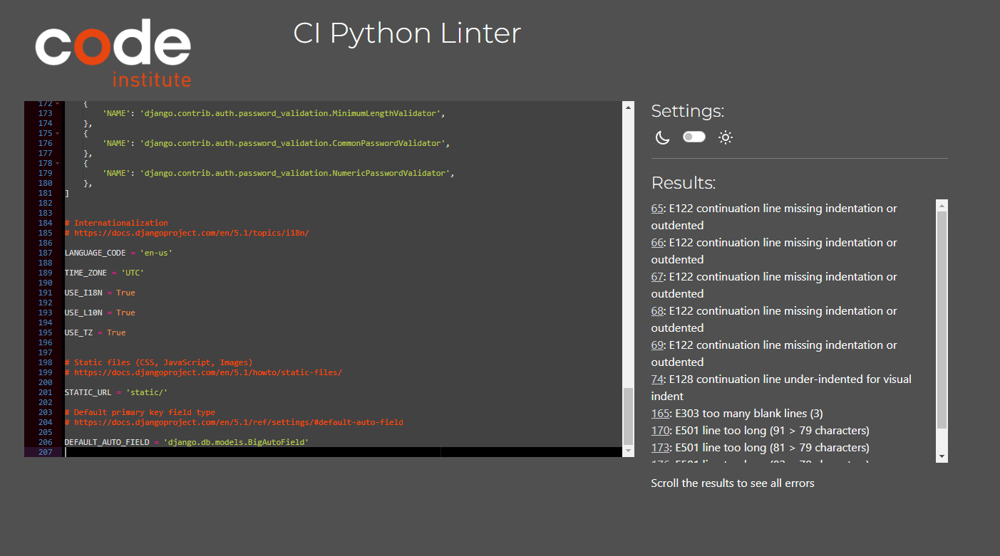

# Pep8 Validations

Below is the validation results from using the PEP8 validator. The most concerning file was the settings.py (screen shot below).

| File | Validation comments | Fixes |
|----------|----------|----------|
| comments > models.py | No new line at end of file | Add a new line at the end |
| comments > serializers.py | Blank line contains whitespace | Delete the leading white space |
| comments > urls.py | No new line at end of file | Add a new line at the end |
| comments > views.py | Line 7 expected 2 empty lines, only has one | Add another line |
| drf_api_project_5 > serializers.py | No new line at end of file | Add a new line at the end |
| drf_api_project_5 > settings.py | REST_AUTH_SERIALIZERS had white space before ' | Delete blank space before colon |
| drf_api_project_5 > settings.py | ALLOWED_HOSTS missing indentation | Indent each variable in the ALLOWED_HOSTS |
| drf_api_project_5 > settings.py | AUTH_VALIDATOR lines too long | Refactored to place some items on next line |
| drf_api_project_5 > views.py | Import of settings line was too long | Separated onto separate lines |
| drf_api_project_5 > views.py | 1 line before api views | Added extra line |
| followers > models.py | owner and followed lines are too long | Moved the keys onto a new line |
| followers > serializers.py | No space around operator | Add space between owner = serializers |
| followers > serializers.py | 'detail' : 'possible duplicate' | 'detail': 'possible duplicate', space before colon |
| followers > serializers.py | No new line at end of file | Added a new line at end of file |
| followers > views.py | Blank spaces on 2 lines | Deleted blank space on lines 14 and 15 |
| posts > serializers.py | White spaces | Delete white space |
| posts > views.py | White spaces | Delete white space |
| profiles > views.py | Expected 2 empty lines, only has one | Add another line |
| trips > serializers.py | Line 4 expected 2 empty lines, only has one | Add another line |
| trips > serializers.py | No space around operator | Add space between owner = serializers |
| trips > views.py | Expected 2 empty lines, only has one | Add another line |

